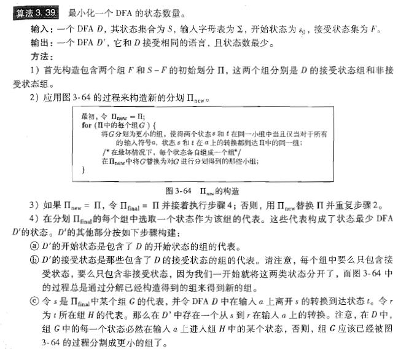
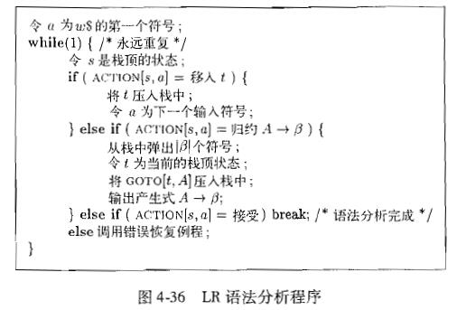

# 简单的C语言编译器
编译原理课程大作业

## 概述
## 成员及分工
### 成员

|    姓名    |  学号   |
| :--------: | :-----: |
| 丁&emsp;泉 | 1612842 |
| 高&emsp;阳 | 1612846 |
|   韩凌昊   | 1612851 |
| 何&emsp;博 | 1612852 |
|   刘元浩   | 1612872 |


### 词法分析
|      任务       |   负责人   |
| :-------------: | :--------: |
| `Lex`版语法分析器 | 丁泉、高阳 |
| 正则表达式转`NFA` |   韩凌昊   |
|     `NFA`合并     |   韩凌昊   |
| `NFA`转`DFA` | 刘元浩 |
|    `DFA`最小化    |    丁泉    |
| 错误和注释处理  |    何博    |
|  文件输入输出   |    何博    |

### 语法分析

| 任务 | 负责人 |
| :-------------: | :--------: |
| 设计文法 | 刘元浩 |
| `FIRST`集、`FOLLOW`集 | 高阳 |
| 构造`LR1`项集 | 韩凌昊 |
| 合并`LR1`项集 | 何博 |
| 生成`GOTO`和`ACTION`表 | 何博 |
| 完成规约移入动作 | 丁泉 |
| 构造语法分析树 | 丁泉 |


### 语义分析与中间代码生成

| 任务 | 负责人 |
| :-------------: | :--------: |
| 设计动作 | 刘元浩、何博 |
| 重构符号表 | 何博 |
| 插入动作 | 丁泉、韩凌昊 |
| 生成中间代码 | 丁泉、韩凌昊 |


### 代码生成

| 任务 | 负责人 |
| :-------------: | :--------: |
| 设计三地址代码用法 | 韩凌昊 |
| 生成汇编代码 | 韩凌昊 |

### 代码优化与错误处理

| 任务 | 负责人 |
| :-------------: | :--------: |
| 类型检查 | 丁泉、刘元浩 |
| 消除死代码 | 丁泉、高阳 |
| 未使用变量的优化 | 丁泉 |
| 恐慌模式 | 丁泉、高阳 |

## 文法
### 综述
&emsp;&emsp;本项目文法在 `ANSI C` 标准的框架范围内设计。文法以`translation_unit`为起始符号，整体结构分为`declaration & initialization`、`expression`和`statement`三大部分。

&emsp;&emsp;项目文法详细内容可见于`productions.txt`，该文件语法：
```
production_head
production_body1
production_body2
production_body3
;;
```

&emsp;&emsp;下面将从上述三个部分展开，因为文法结构较为复杂，所以仅从部分主要非终结符的角度对项目文法进行简要解释。

---

### declaration & initialization
&emsp;&emsp;声明与定义。包含函数、一般变量（`int` 类型变量、结构体变量）及结构体类型的声明和定义，变量定义支持传值初始化。

&emsp;&emsp;函数：
>`function_definition`<br>
>&emsp;&emsp;函数定义， 支持`type f(type a) {...}`的定义方式。

>`type_specifier`<br>
>&emsp;&emsp;类型分类符，可推导成为基本类型分类符`int`、`void`和结构体类型分类符`struct struct_name`。

>`direct_declarator`<br>
>&emsp;&emsp;直接声明符，可推导成为：<br>
>&emsp;&emsp;&emsp;&emsp;`IDENTIFIER` 标识符，用于声明一般变量<br>
>&emsp;&emsp;&emsp;&emsp;`IDENTIFIER [ assignment_expression ]` 数组变量标识，用于声明数组<br>
>&emsp;&emsp;&emsp;&emsp;`direct_declarator ( parameter_list )` 有参数的函数声明符<br>
>&emsp;&emsp;&emsp;&emsp;`direct_declarator ( )` 无参数的函数声明符<br>

>`function_compound_statement`<br>
>&emsp;&emsp;函数体定义语句块，可推导成为：<br>
>&emsp;&emsp;&emsp;&emsp;`{ }` 空语句块<br>
>&emsp;&emsp;&emsp;&emsp;`{ statement_list }` 没有声明语句的函数体语句块<br>
>&emsp;&emsp;&emsp;&emsp;`{ declaration_list }` 只有声明语句的函数体语句块<br>
>&emsp;&emsp;&emsp;&emsp;`{ declaration_list statement_list }` 有声明语句的函数体语句块<br>

>`parameter_list`<br>
>&emsp;&emsp;参数声明列表，支持带参数名的参数声明和只有类型分类符的参数声明。

&emsp;&emsp;一般变量：

>`declaration`<br>
>&emsp;&emsp;变量声明语句，可推导成为：<br>
>&emsp;&emsp;&emsp;&emsp;`type_specifier ;` 只有类型分类符的声明语句<br>
>&emsp;&emsp;&emsp;&emsp;`type_specifier init_declarator_list ;` 变量声明语句，支持同类型多变量同时声明<br>

>`init_declarator`<br>
>&emsp;&emsp;初始化声明符，`init_declarator_list`中的单项，可推导成为：<br>
>&emsp;&emsp;&emsp;&emsp;`declarator` 默认变量声明初始化<br>
>&emsp;&emsp;&emsp;&emsp;`declarator = initializer` 传值的变量声明初始化<br>

&emsp;&emsp;结构体类型：

>`struct_or_union_specifier`<br>
>&emsp;&emsp;结构体类型分类符，用于结构体类型的声明定义，或声明结构体类型变量时作为类型分类符，可推导成为：<br>
>&emsp;&emsp;&emsp;&emsp;`STRUCT IDENTIFIER { struct_declaration_list }` 带有结构体名的结构体类型定义<br>
>&emsp;&emsp;&emsp;&emsp;`STRUCT { struct_declaration_list }` 不带结构体名的结构体类型定义<br>
>&emsp;&emsp;&emsp;&emsp;`STRUCT IDENTIFIER` 仅用于声明结构体类型变量时作为类型分类符<br>

>`struct_declaration`<br>
>&emsp;&emsp;结构体中成员变量的声明，`struct_declaration_list`中的单项，支持同类型多变量同时声明<br>

---

### expression
&emsp;&emsp;表达式。承担了程序中的运算功能。`expression`的产生式成链状结构，反映了程序中各种运算的优先级关系。

>`expression`<br>
>&emsp;&emsp;表达式的最高形式，可直接推导成为一个或多个`assignment expression`连接而成的逗号表达式。<br>

>`assignment_expression`<br>
>&emsp;&emsp;赋值表达式，可推导成为：<br>
>&emsp;&emsp;&emsp;&emsp;`logical_or_expression` 逻辑或表达式<br>
>&emsp;&emsp;&emsp;&emsp;`unary_expression = assignment_expression`直接赋值表达式<br>

>`logical_or_expression`<br>
>&emsp;&emsp;逻辑或表达式，可推导成为：<br>
>&emsp;&emsp;&emsp;&emsp;`logical_and_expression` 逻辑与表达式<br>
>&emsp;&emsp;&emsp;&emsp;`logical_or_expression OR_OP logical_and_expression`逻辑或运算表达式<br>

>`logical_and_expression`<br>
>&emsp;&emsp;逻辑与表达式，可推导成为：<br>
>&emsp;&emsp;&emsp;&emsp;`exclusive_or_expression` 按位异或表达式<br>
>&emsp;&emsp;&emsp;&emsp;`logical_or_expression OR_OP logical_and_expression`逻辑与运算表达式<br>

>`exclusive_or_expression`<br>
>&emsp;&emsp;按位异或表达式，可推导成为：<br>
>&emsp;&emsp;&emsp;&emsp;`equality_expression` 判等表达式<br>
>&emsp;&emsp;&emsp;&emsp;`exclusive_or_expression ^ equality_expression`按位异或运算表达式<br>

>`equality_expression`<br>
>&emsp;&emsp;判等表达式，可推导成为：<br>
>&emsp;&emsp;&emsp;&emsp;`relational_expression` 关系表达式<br>
>&emsp;&emsp;&emsp;&emsp;`equality_expression EQ_OP relational_expression`判等运算表达式<br>
>&emsp;&emsp;&emsp;&emsp;`equality_expression NE_OP relational_expression`判不等运算表达式<br>

>`relational_expression`<br>
>&emsp;&emsp;关系表达式，可推导成为：<br>
>&emsp;&emsp;&emsp;&emsp;`additive_expression` 加法表达式<br>
>&emsp;&emsp;&emsp;&emsp;`relational_expression < shift_expression`判小于运算表达式<br>
>&emsp;&emsp;&emsp;&emsp;`relational_expression > shift_expression`判大于运算表达式<br>
>&emsp;&emsp;&emsp;&emsp;`relational_expression LE_OP shift_expression`判大于等于运算表达式<br>
>&emsp;&emsp;&emsp;&emsp;`relational_expression GE_OP shift_expression`判小于等于运算表达式<br>

>`additive_expression`<br>
>&emsp;&emsp;加法表达式，可推导成为：<br>
>&emsp;&emsp;&emsp;&emsp;`multiplicative_expression` 乘法表达式<br>
>&emsp;&emsp;&emsp;&emsp;`additive_expression + multiplicative_expression`加法运算表达式<br>
>&emsp;&emsp;&emsp;&emsp;`additive_expression - multiplicative_expression`减法运算表达式<br>

>`multiplicative_expression`<br>
>&emsp;&emsp;加法表达式，可推导成为：<br>
>&emsp;&emsp;&emsp;&emsp;`cast_expression` 类型转换表达式<br>
>&emsp;&emsp;&emsp;&emsp;`multiplicative_expression * cast_expression`乘法运算表达式<br>
>&emsp;&emsp;&emsp;&emsp;`multiplicative_expression / cast_expression`除法运算表达式<br>
>&emsp;&emsp;&emsp;&emsp;`multiplicative_expression % cast_expression`取模运算表达式<br>

>`cast_expression`<br>
>&emsp;&emsp;加法表达式，可推导成为：<br>
>&emsp;&emsp;&emsp;&emsp;`unary_expression` 单元运算表达式<br>
>&emsp;&emsp;&emsp;&emsp;`( type_name ) cast_expression`强制类型转换运算表达式<br>

>`unary_expression`<br>
>&emsp;&emsp;单元运算表达式，可推导成为：<br>
>&emsp;&emsp;&emsp;&emsp;`postfix_expression` 后缀表达式<br>
>&emsp;&emsp;&emsp;&emsp;`INC_OP unary_expression`前自增运算表达式<br>
>&emsp;&emsp;&emsp;&emsp;`DEC_OP unary_expression`前自减运算表达式<br>
>&emsp;&emsp;&emsp;&emsp;`unary_operator cast_expression`单元符号运算表达式，包括逻辑非和取相反数等<br>
>&emsp;&emsp;&emsp;&emsp;`SIZEOF unary_expression`对表达式的取宽度运算表达式<br>
>&emsp;&emsp;&emsp;&emsp;`SIZEOF ( type_name )`对类型名的取宽度运算表达式<br>

>`postfix_expression`<br>
>&emsp;&emsp;后缀表达式，可推导成为：<br>
>&emsp;&emsp;&emsp;&emsp;`primary_expression` 原子表达式<br>
>&emsp;&emsp;&emsp;&emsp;`IDENTIFIER [ expression ]`数组取元素运算表达式<br>
>&emsp;&emsp;&emsp;&emsp;`postfix_expression ( )`无参函数调用表达式<br>
>&emsp;&emsp;&emsp;&emsp;`postfix_expression ( argument_expression_list )`传参函数调用表达式<br>
>&emsp;&emsp;&emsp;&emsp;`IDENTIFIER . IDENTIFIER`结构体取成员变量表达式<br>
>&emsp;&emsp;&emsp;&emsp;`postfix_expression INC_OP`后自增运算表达式<br>
>&emsp;&emsp;&emsp;&emsp;`postfix_expression DEC_OP`后自减运算表达式<br>

>`primary_expression`<br>
>&emsp;&emsp;原子表达式，表达式的基本单元，可推导成为：<br>
>&emsp;&emsp;&emsp;&emsp;`IDENTIFIER` 标识符<br>
>&emsp;&emsp;&emsp;&emsp;`CONSTANT`常量<br>
>&emsp;&emsp;&emsp;&emsp;`( expression )`表达式的循环嵌套<br>

---

### statement
&emsp;&emsp;语句。用来表征程序代码结构和执行顺序，分为`compound_statement`、`expression_statement`、`selection_statement`、`iteration_statement`、`jump_statement`五类。

>`compound_statement`<br>
>&emsp;&emsp;复合语句，用于标识除函数体定义语句块外的语句块,可推导成为：<br>
>&emsp;&emsp;&emsp;&emsp;`{ }` 空语句块<br>
>&emsp;&emsp;&emsp;&emsp;`{ statement_list }` 没有声明语句的语句块<br>
>&emsp;&emsp;&emsp;&emsp;`{ declaration_list }` 只有声明语句的语句块<br>
>&emsp;&emsp;&emsp;&emsp;`{ declaration_list statement_list }` 有声明语句的语句块<br>

>`expression_statement`<br>
>&emsp;&emsp;表达式语句，为表达式后加上分号，使其成为语句。<br>

>`selection_statement`<br>
>&emsp;&emsp;分支语句，可推导成为`if`，`switch`分支语句。<br>

>`iteration_statement`<br>
>&emsp;&emsp;循环语句，可推导成为`for`，`while`循环语句。<br>

>`jump_statement`<br>
>&emsp;&emsp;跳转语句，用于实现`break`、`continue`等跳转功能。<br>

## 算法实现及分析
### 词法分析

#### 思路

1. 正则表达式转`NFA`:  
    - 将中缀正则表达式转为后缀表达式
    - 对后缀表达式构造语法分析树
    - 使用[Thompson构造法](https://zh.wikipedia.org/wiki/Thompson%E6%9E%84%E9%80%A0%E6%B3%95)将语法分析树转换为`NFA`
2. `NFA`合并：
    - 将所有生成的`NFA`以或的关系连接到一起，生成一个总的`NFA`
3. `NFA`转`DFA`：

4. `DFA`最小化：



5. 文件输入和错误、注释处理：在此阶段编译器读入测试文件，将测试文件中的所有注释清除，根据先前阶段构建的`DFA`和对应的终态编号分析源文件的各个词素，并将文件转化为词法单元序列提供给语法分析器。

#### 数据结构

1. 正则表达式转`NFA`:
    
    正则表达式语法分析树节点：
    ``` c++
    struct RegTreeNode
    {
        // 该节点的操作符
        char reg_op; // '\1'='*', '\2'='|', '\3'='.', '\4'='(', '\5'=')'
        // 该节点的左右子节点
        RegTreeNode* left;
        RegTreeNode* right;
        // 起止状态号
        int start;
        int end;
        // 构造函数
        RegTreeNode(char _reg_op, RegTreeNode* _left = nullptr, RegTreeNode* _right = nullptr);
    };
    ```

    正则表达式：
    ```c++
    class RegExp
    {
        // 中缀表达式字符串
        std::string infix_exp;
        // 后缀表达式字符串
        std::string suffix_exp;
        // 语法分析树根节点指针
        RegTreeNode* reg_tree;
    public:
        // 构造函数
        RegExp(std::string exp, int mode = 0);
        // 返回该后缀表达式字符串
        std::string get_suffix_exp();
        // 返回语法分析树根节点指针
        RegTreeNode* get_reg_tree();
        // 将后缀表达式输出到控制台
        void get_explicit_suffix_exp();
    private:
        // 中缀表达式转后缀表达式
        std::string to_suffix();
        // 后缀表达式转正则树
        RegTreeNode* to_reg_tree();
        // 判断操作符优先级
        bool is_prior(char opreand1, char operand2);
        // 判断是否为操作符
        bool is_operator(char operand);
    };
    ```


2. `NFA`合并：

3. `NFA`转`DFA`：

```c++
class NfaToDfa
{
public:
  NfaToDfa(Nfa nfa);
  ~NfaToDfa();

  Nfa nfa;
  int* wordlist;

  int** dfa_map;
  int dfa_s;
  int n_dfa_states;
  int n_chars;
  map<int, string> dfa_end;

  set<int> closure(set<int> T);
  set<int> next(int head, int character);
  void transform();
};
```

4. `DFA`最小化：

&emsp;&emsp;以下列出记录最小化`DFA`信息的数据结构

```c++
class Min_DFA {
public:
    vector<set<int>> vec;
    // 记录DFA初态的编号
    int dfa_s;
    // 记录原DFA状态数量
    int n_dfa_states;
    // 记录输入字符类型数量
    int n_chars;
    // 存储传入的DFA
    int** matrix;

    // 非终态集合
    set<int> start_set;
    // 终态集合
    set<int> final_set;

    // 记录最小化DFA结果
    vector<vector<int>>ans;
    map<int, string>map_ans;
    // 记录最小化DFA中初态的编号
    int start_state_ans;
}
```

&emsp;&emsp;以下列出进行最小化`DFA`的操作函数

```c++
    // 最小化DFA具体实现操作
    Min_DFA(map<int, string> dfa_end, int** dfa_map, int dfa_s, int n_dfa_states, int n_chars);

    // 获取一个状态所在集合的编号（即该集合第一个状态的编号）
    int get_begin(int destination);
    int get_position(int destination);

    // 拆分集合的函数
    bool break_up(set<int> origin_set);
}
```

5. 文件输入和错误、注释处理：

&emsp;&emsp;首先从上游`DFA`文件读出

```c++
int row_number; //DFA 矩阵行数
int column_number; //DFA 矩阵列数
int** matrix; //DFA 矩阵
std::map<int, std::string> status_to_pattern //状态编号到模式的映射关系
```

&emsp;&emsp;并初始化输出序列

```c++
std::vector<LexicalUnit> output_sequence;
```

&emsp;&emsp;其中`LexicalUnit`为一个词法单元：

```c++
class LexicalUnit
{
public:
    std::string name;
    std::string morpheme;
    // 在后期未使用，故删除
    // std::string value;
}
```

&emsp;&emsp;使用以下四个函数进行文件的词法分析：

```c++
// 从文件中读入一个字符，并输入到DAF矩阵中进行状态装换
auto feed(char ch) -> void; 

// 处理测试文件中多行注释
void deal_with_multiplied_note();

// 处理文件中单行注释
void deal_with_line_note();

// 更新词法单元序列
void update_output_sequence();
```

`feed(char ch)`在进行状态转换时，如果遇见注释则会调用处理注释的函数；如果出现死态则调用函数`update_output_sequence()`更新词法单元序列；若输入非C语言字符(@等)则会报错。

#### 遇到的问题

1. 正则表达式转`NFA`：
    无
2. `NFA`合并：
    无
3. `NFA`转`DFA`：

4. `DFA`最小化：
    - 不同的正则表达式，其终态在初始化终态的集合时应分立到不同的集合中去，同一正则表达式的不同终态在初始化终态的集合时应归到相同的集合中。该BUG未能在小规模测试中找到。

5. 文件输入和错误、注释处理：
    - 使用`char`类型存储读入字符，无法读入中文字符；
    - 未处理文件中字符串(`""`)。

#### 成果

1. 正则表达式转`NFA`:
    - 将所有词法单元的正则表达式转换成`NFA`。
2. `NFA`合并：
    - 生成一个可以识别所有词法单元的`NFA`。
3. `NFA`转`DFA`：

4. `DFA`最小化：
    - 成功完成`DFA`状态的最小化，并将简化后的状态转换表存入文件中。
5. 文件输入和错误、注释处理：
    - 读入`DFA`和测试源文件；
    - 输出词法单元序列并传递给语法分析器。

---

### 语法分析

#### 思路

1. 设计文法：见上文文法部分

2. 求`FIRST`集、`FOLLOW`集：见龙书第二版104~141页

3. 构造`LR1`项集：见龙书第二版167页

4. 合并`LR1`项集形成`LALR1`：查询并合并`LR1`中所有的同心集，优化状态数量，删除被合并的项目族和对应的`GO`函数，得到`LALR1`项目族集合和对应的`GO`函数

5. 生成`GOTO`和`ACTION`表：通过`LALR1`的`GO`函数生成对应的`GOTO`表和`ACTION`表。

6. 完成归约移入动作：


7. 构造语法分析树：
按照产生式和`Action`表以及`Goto`表对词法单元序列进行移入归约操作。在进行归约操作时构造新的父节点以及相应的子节点。最后将唯一的父节点作为整棵语法分析树的根节点保存在`root`属性中。

#### 数据结构

1. 设计文法

&emsp;&emsp;符号数据结构

```c++
class Symbol
{
public:
  string value;
  unordered_set<Terminal*> first_set;
  bool start_as_epsilon;

  Symbol();
  Symbol(string input);
  bool operator==(const Symbol & a);
  virtual int get_id() const;
  friend ostream& operator<<(ostream& out, const Symbol& symbol);

private:

};

class Terminal : public Symbol
{
public:
  Terminal();
  Terminal(string input);
  int get_id() const;
private:

};

class Nonterminal : public Symbol
{
public:
  unordered_set<Terminal*> follow_set;

  Nonterminal();
  Nonterminal(string input);
  int get_id() const;

private:
};

class Production
{
public:
  Nonterminal* left;
  vector<Symbol*> right;

  Production();
  Production(Nonterminal* start, const vector<Symbol*>& symbol);
  void init(Nonterminal* start, const vector<Symbol*>& symbol);
  friend ostream& operator<<(ostream& out, Production production);

private:
};
```
2. 求`FIRST`集、`FOLLOW`集

3. 构造`LR1`项集

&emsp;&emsp;LR1项目数据结构

```c++
class LR1Item {
public:
  Production* production;
  int position;
  vector<Terminal*> forward;
  int productionNum;
  Symbol* expect;
  LR1Item* next;
  

  LR1Item(Production* production, int pnum, int pos = 0);
  ~LR1Item();
  bool addForward(Terminal* ter);
  bool addForwards(vector<Terminal*> ters);
  bool operator==(LR1Item &a);
  friend ostream& operator<<(ostream& out, LR1Item iter);
};
```

&emsp;&emsp;LR1项目集数据结构

```c++
class LR1ItemSet {
public:
  vector<LR1Item*> itemset;

  LR1ItemSet(LR1Item* item);
  LR1ItemSet();
  ~LR1ItemSet();
  std::pair<bool, bool> addItem(LR1Item* Item);
  bool addItem4NewSet(LR1Item* Item);
  bool operator==(LR1ItemSet& a);
  friend ostream& operator<<(ostream& out, LR1ItemSet iterSet);
};
```

&emsp;&emsp;LR1项目集族数据结构

```c++
class LR1ItemSets {
private:
  vector<int> Goline;
  
  void addLine();
  bool Go(LR1ItemSet* s, Symbol* x);
  LR1ItemSet* addItemSet(LR1ItemSet* itemSet);
  void closure(LR1ItemSet* itemSet);
  LR1Item* newNext(LR1Item* item);
public:
  vector<LR1ItemSet*> itemSets;
  vector<Symbol*> symbols;
  vector<Terminal*> terminals;
  vector<Nonterminal*> nonterminals;
  vector<Production*> productions;
  vector<vector<int>> GO;

  vector<vector<string>> action_table;
  vector<vector<int>> goto_table;

  LR1ItemSets(ContextFreeGrammar grammar);

  int8_t can_merge(int status_1, int status_2);
  void merge_all();
  void merge_go_table(int status_1, int status_2);
  void merge_itemSets(int status_1, int status_2);

  void set_action_and_goto();
  void output();
  ~LR1ItemSets();
  void getSets();
};
```

4. 合并`LR1`项集形成`LALR1`：

* `merge_all()`函数进行合并同心集，该函数会遍历项目族集合
* 在`merge_all()`函数中使用`can_merge(int, int)`查看两个状态是否能够进行合并
* 如果能够合并则调用`merge_go_table(int, int)`和`merge_itemSets(int, int)`进行`GO`表的合并和项目族的合并。

5. 生成`GOTO`和`ACTION`表：


* 从以上步骤得到`LALR1`的状态集合
* 如果有=I_j,X\in%20terminal)，则置=s_j)
* 如果有=I_j,X\in%20nonterminal)，则置=j)
* 如果项目在状态中，则置=r_k)，其中为产生式对应的序号
* 如果增广文法开始项目在中，则置=acc)


6. 完成归约移入动作：
7. 构造语法分析树：

```c++
class GrammerAnalyzer {
private:
    // 定义存储产生式的结构体，内部使用一个存储类型为string的vector记录产生式各个部分的内容
    typedef struct production {
        std::vector<std::string*> production_formula;
        production() {}
    }production;

    // 读入内存中存储的词法单元序列
    std::vector<hebo::LexicalUnit> output_sequence;

    // 记录终结符
    int terminal_number;
    std::string** terminal_list;

    // 记录非终结符
    int non_terminal_number;
    std::string** non_terminal_list;

    // 记录所有产生式的内容
    int production_number;
    production** production_list;

    // 记录action表和goto表的内容（从文件中读入）
    int table_number;
    std::vector<std::vector<std::string*>> action_table;
    std::vector<std::vector<std::string*>> goto_table;

public:
    // 记录最后生成语法树根节点的位置
    hebo::LexicalUnit* root;

private:
    // 从文件中读入所有信息，初始化各个表和数组
    void initialization();
    // 读入词法单元序列，构造语法树
    hebo::LexicalUnit* init_tree();
    // 前序遍历输出语法树
    void output_tree(hebo::LexicalUnit*, int);
}
```

#### 遇到的问题

1. 设计文法

2. 求`FIRST`集、`FOLLOW`集

3. 构造`LR1`项集

4. 合并`LR1`项集形成`LALR1`：

- 试图使用快速构建法直接构建`LALR1`，但是出现相同输入相同程序但输出不同的BUG，估计指针管理不当


5. 生成`GOTO`和`ACTION`表：

- 文法存在移进-归约冲突，但是在此处仅做出标记，未进一步解决

6. 完成归约移入动作：

- `C`语言读取文件（抽取产生式等信息的操作）函数使用不熟练；

- 在进行语法分析时错误使用浅拷贝赋值指针的位置，应使用深拷贝赋值指针指向的内容。

7. 构造语法分析树：

- 归约时符号弹出栈的顺序（自右向左）与构造语法分析树子节点（自左向右）的顺序相反；

- 如何输出一棵优美的语法分析树，是个问题。

#### 成果 

1. 设计文法

- 产生了符合项目要求的文法
- 为进一步工作提供了恰当的接口

2. 求`FIRST`集、`FOLLOW`集

- 求得了`FIRST`集、`FOLLOW`集

3. 构造`LR1`项集

- 构造出了`LR1`项集

4. 合并`LR1`项集形成`LALR1`：

- 减少状态数量从1000以上到300左右，提高分析器查表效率

5. 生成`GOTO`和`ACTION`表：

- 为分析器提供分析表

6. 完成归约移入动作：

- 从文件中正确读入文法各项信息；

- 根据`Action`表和`Goto`表准确无误地处理了词法单元序列。

7. 构造语法分析树：

- 正确生成归约操作对应的语法分析树。

---

### 语义分析与中间代码生成

#### 思路

1. 设计动作：见龙书第二版第六章

2. 重构符号表：词法分析完成的符号表无法存储源程序各个词素的详细信息，故重构符号表，在语义计算时新建并维护符号表、结构体表和函数表。

3. 插入动作：读入含有动作的产生式，更新语法分析部分的生成的产生式列表；重构记录节点的结构体，将节点属性、动作等内容加入；在节点内用`bool`变量`if_action`区分动作节点与属性节点；重写规约时构造语法分析树的代码。

4. 生成中间代码：与汇编代码定义好接口，从根节点前序遍历整棵语法树，遇到动作节点时通过访问`SwitchToFunction.cpp`找到并执行对应的动作函数，将生成的四元式保存在内存中供下一步使用。

#### 数据结构

1. 设计动作

2. 重构符号表： 结构体表和函数表的大致结构与符号表相同

```c++
  class SymbolItem
  {
    static int symbol_count; // 记录表中已有多少符号
  public:
    SymbolItem();
    std::string address; // 符号地址, 提供给四元式
    std::string name; // 符号词素
    std::string type; // 符号类型
    int offset; // 偏移量 但后续为使用
    int width; // 符号宽度, 即符号占用内存字节数
    SymbolItem(std::string _name, std::string _type, int _offset, int _width); // 构造函数
  };

  class SymbolTable
  {
    static int symbol_table_count; // 符号表数量
    void put_struct(std::string object_name, std::string struct_name); // 向符号表中插入一个结构体变量
    void put_struct_array(std::string array_name, std::string struct_name, int length); // 向符号表中插入一个结构体数组
  public:
    SymbolTable* father; // 上级符号表
    std::vector<SymbolItem> symbol_item_vector; // 该vector当前符号表所存储的符号
    std::string symbol_table_name; // 符号表名称
    std::vector<SymbolTable*> son_vector;  // 该vector该符号表下的各个子符号表

    SymbolTable(); // 默认构造函数
    SymbolTable(std::string _name, SymbolTable* _father = nullptr);
    SymbolTable(const SymbolTable& copied);

    void put_symbol(const SymbolItem& symbol) throw(std::string); // 向符号表内插入一个符号
    SymbolItem& get_symbol(std::string symbol_name) throw(std::string); // 通过符号的名字得到符号表中该符号的引用
    SymbolItem& get_symbol_from_address(std::string symbol_address) throw(std::string); // 通过符号的地址得到符号表中该符号的引用
    
    ~SymbolTable();
  };

  
```

3. 插入动作：
4. 生成中间代码：

```c++
// 以下只列出对GrammerAnalyzer类修改的部分
class GrammerAnalyzer {
    // 记录含有动作产生式的信息，更新production_list
    int production_action_number;
    std::vector<std::pair<int, int>>* transfer_list;
    production** production_list;

    // 函数调用时，记录声明函数的信息，供插入到函数名表使用
    std::vector<int> var_width_list;
    std::vector<std::string> var_name_list;

    // 记录当前所处函数的名字，供构造新的函数表对象使用
    std::string curr_func_name;

public:
    // 存储四元式的数据结构
    typedef struct {
        int index = -1;
        std::string op;
        std::string arg1;
        std::string arg2;
        std::string result;
    }three_address_instruction;

    // 记录四元式内容至内存
    std::vector<three_address_instruction*> final_instruction;

    // 记录全局符号表
    hbst::SymbolTable* out_table;

    // 记录结构体符号表
    hbst::StructTable* struct_table;

    // 记录函数符号表
    hbst::FunctionTable* function_table;

    // 构造函数
    GrammerAnalyzer(std::vector<hebo::LexicalUnit>);
}

// 对于一维数组属性信息的记录，包括数组名，元素类型，元素宽度，符号表中位置，元素地址
typedef struct {
    std::string name;
    std::string element_type;
    std::string pos;
    int element_width;
    std::vector<std::string> element_addr;
} array_info;

class LexicalUnit {
public:
    // 语法分析树节点信息：名字、词素值、是否动作节点、对应动作编号
    std::string name;
    bool if_action;
    int action_num;
    std::string morpheme;

    // 语法分析树节点属性信息：
    struct attribute {
        // 类型宽度、类型名、在符号表中位置
        int width;
        std::string type;
        std::string addr;

        // （如果是常量）常量值
        int const_value;

        // （如果是运算符）运算符值
        std::string op_value;

        // （如果是结构体）结构体信息
        bool if_struct;
        hbst::StructItem struct_info;

        // （如果是数组）数组信息
        array_info array_info;

        // （如果是函数调用）函数参数个数
        int param_number;

        // （如果是动作节点 需要生成四元式） 当前四元式编号
        int instr;

        // （控制流四元式）下一跳转四元式编号，为真跳转、为假跳转四元式编号（回填） continue、break跳转四元式编号
        int next_instr;
        int true_instr;
        int false_instr;
        int con_instr;
        int break_instr;
    } attribute;

    // （语法分析树上）子节点列表 父节点
    std::vector<LexicalUnit*> child_node_list;
    LexicalUnit* father;

    // 节点默认构造函数，默认非动作节点，无父节点，非控制流指令，非数组节点，非结构体节点
    LexicalUnit() {
        this->if_action = false;
        this->action_num = -1;
        this->father = NULL;
        this->attribute.instr = -1;
        this->attribute.next_instr = -1;
        this->attribute.true_instr = -1;
        this->attribute.false_instr = -1;
        this->attribute.con_instr = -1;
        this->attribute.break_instr = -1;
        this->attribute.if_struct = false;
    }
};
```

#### 遇到的问题

1. 设计动作

- 根据项目需求，对布尔表达式的翻译改变了书中的模式，使布尔表达式返回为int值，在循环和分支语句判断条件时根据判0原则生成跳转语句。

2. 重构符号表：无问题

3. 插入动作：

- 由于前期总体设计未考虑周全，导致构造语法分析树时未能将动作节点直接加入；且在产生式列表生成过程中使用了`set`，使得每次生成产生式，其顺序都不一样；因此使用`O(n^2)`代价的扫描将加入节点的产生式合并进原产生式列表中。此处未来可以优化。

- 动作设计过程中，一些属性值传递的动作没有设计完全，导致前期生成中间代码无法运行。

4. 生成中间代码：

- 无问题。

#### 成果 

1. 设计动作

- 设计出了符合项目需求的语义动作

2. 重构符号表：为后续提供查询符号提供便利，并且可以处理重定义和未声明变量的错误处理

3. 插入动作：

- 将原产生式更新为含有动作的产生式，在规约时正确生成语法分析树。

4. 生成中间代码：

- 在对语法分析树的前序遍历过程中正确生成了中间代码，与汇编代码的接口定义良好，运行无误。

---

### 代码生成

#### 思路
1. 与前端确定三地址指令的格式与用法
2. 从前端获取以下信息：
    - 三地址指令列表
    - 符号表
    - 结构体表
    - 函数表
3. 顺序遍历三地址指令列表，生成汇编代码

#### 数据结构
1. 三地址指令用法表
    <table>
    <tbody>
    <tr>
        <th width="15%" align="center">op</th>
        <th width="15%" align="center">arg1</th>
        <th width="15%" align="center">arg2</th>
        <th width="15%" align="center">result</th>
        <th width="40%" align="center">说明</th>
    </tr>
    <tr>
        <td colspan="5" align="center"><b>双目运算指令</b></td>
    </tr>
    <tr>
        <td align="center">+</td>
        <td align="center">operand1</td>
        <td align="center">operand2</td>
        <td align="center">result</td>
        <td>result = operand1 + operand2</td>
    </tr>
    <tr>
        <td align="center">-</td>
        <td align="center">operand1</td>
        <td align="center">operand2</td>
        <td align="center">result</td>
        <td>result = operand1 - operand2</td>
    </tr>
    <tr>
        <td align="center">*</td>
        <td align="center">operand1</td>
        <td align="center">operand2</td>
        <td align="center">result</td>
        <td>result = operand1 * operand2</td>
    </tr>
    <tr>
        <td align="center">/</td>
        <td align="center">operand1</td>
        <td align="center">operand2</td>
        <td align="center">result</td>
        <td>result = operand1 / operand2</td>
    </tr>
    <tr>
        <td align="center">%</td>
        <td align="center">operand1</td>
        <td align="center">operand2</td>
        <td align="center">result</td>
        <td>result = operand1 % operand2</td>
    </tr>
    <tr>
        <td align="center">^</td>
        <td align="center">operand1</td>
        <td align="center">operand2</td>
        <td align="center">result</td>
        <td>result = operand1 ^ operand2</td>
    </tr>
    <tr>
        <td align="center">=</td>
        <td align="center">operand</td>
        <td align="center">-</td>
        <td align="center">result</td>
        <td>result = operand</td>
    </tr>
    <tr>
        <td colspan="5" align="center"><b>单目运算指令</b></td>
    </tr>
    <tr>
        <td align="center">++</td>
        <td align="center">operand</td>
        <td align="center">-</td>
        <td align="center">result</td>
        <td>result = operand++</td>
    </tr>
    <tr>
        <td align="center">--</td>
        <td align="center">operand</td>
        <td align="center">-</td>
        <td align="center">result</td>
        <td>result = operand--</td>
    </tr>
    <tr>
        <td align="center">MINUS</td>
        <td align="center">operand</td>
        <td align="center">-</td>
        <td align="center">result</td>
        <td>result = -operand</td>
    </tr>
    <tr>
        <td align="center">!</td>
        <td align="center">operand</td>
        <td align="center">-</td>
        <td align="center">result</td>
        <td>result = !operand</td>
    </tr>
    <tr>
        <td colspan="5" align="center"><b>数组操作指令</b></td>
    </tr>
    <tr>
        <td align="center">=[]</td>
        <td align="center">array</td>
        <td align="center">offset</td>
        <td align="center">operand</td>
        <td>operand = array[offset]</td>
    </tr>
    <tr>
        <td align="center">[]=</td>
        <td align="center">array</td>
        <td align="center">offset</td>
        <td align="center">operand</td>
        <td>array[offset] = operand</td>
    </tr>
    <tr>
        <td colspan="5" align="center"><b>跳转指令（line）为跳转到的行号</b></td>
    </tr>
    <tr>
        <td align="center">JMP</td>
        <td align="center">-</td>
        <td align="center">-</td>
        <td align="center">line</td>
        <td>无条件跳转</td>
    </tr>
    <tr>
        <td align="center">JE</td>
        <td align="center">operand1</td>
        <td align="center">operand2</td>
        <td align="center">line</td>
        <td>operand1等于operand2则跳转</td>
    </tr>
    <tr>
        <td align="center">JNE</td>
        <td align="center">operand1</td>
        <td align="center">operand2</td>
        <td align="center">line</td>
        <td>operand1不等于operand2则跳转</td>
    </tr>
    <tr>
        <td align="center">JG</td>
        <td align="center">operand1</td>
        <td align="center">operand2</td>
        <td align="center">line</td>
        <td>operand1大于operand2则跳转</td>
    </tr>
    <tr>
        <td align="center">JNG</td>
        <td align="center">operand1</td>
        <td align="center">operand2</td>
        <td align="center">line</td>
        <td>operand1不大于operand2则跳转</td>
    </tr>
    <tr>
        <td align="center">JGE</td>
        <td align="center">operand1</td>
        <td align="center">operand2</td>
        <td align="center">line</td>
        <td>operand1大于等于operand2则跳转</td>
    </tr>
    <tr>
        <td align="center">JNGE</td>
        <td align="center">operand1</td>
        <td align="center">operand2</td>
        <td align="center">line</td>
        <td>operand1不大于等于operand2则跳转</td>
    </tr>
    <tr>
        <td align="center">JL</td>
        <td align="center">operand1</td>
        <td align="center">operand2</td>
        <td align="center">line</td>
        <td>operand1小于operand2则跳转</td>
    </tr>
    <tr>
        <td align="center">JNL</td>
        <td align="center">operand1</td>
        <td align="center">operand2</td>
        <td align="center">line</td>
        <td>operand1不小于operand2则跳转</td>
    </tr>
    <tr>
        <td align="center">JLE</td>
        <td align="center">operand1</td>
        <td align="center">operand2</td>
        <td align="center">line</td>
        <td>operand1小于等于operand2则跳转</td>
    </tr>
    <tr>
        <td align="center">JNLE</td>
        <td align="center">operand1</td>
        <td align="center">operand2</td>
        <td align="center">line</td>
        <td>operand1不小于等于operand2则跳转</td>
    </tr>
    <tr>
        <td align="center">JZ</td>
        <td align="center">operand</td>
        <td align="center">-</td>
        <td align="center">line</td>
        <td>operand为假则跳转</td>
    </tr>
    <tr>
        <td align="center">JNZ</td>
        <td align="center">operand</td>
        <td align="center">-</td>
        <td align="center">line</td>
        <td>operand为真则跳转</td>
    </tr>
    <tr>
        <td colspan="5" align="center"><b>函数调用指令</b></td>
    </tr>
    <tr>
        <td align="center">PARAM</td>
        <td align="center">argument</td>
        <td align="center">-</td>
        <td align="center">-</td>
        <td>将argument添加到参数列表</td>
    </tr>
    <tr>
        <td align="center">CALL</td>
        <td align="center">name</td>
        <td align="center">-</td>
        <td align="center">-</td>
        <td>调用名为name的函数</td>
    </tr>
    <tr>
        <td colspan="5" align="center"><b>函数定义指令</b></td>
    </tr>
    <tr>
        <td align="center">FUNC</td>
        <td align="center">name</td>
        <td align="center">-</td>
        <td align="center">-</td>
        <td>定义一个为name的函数</td>
    </tr>
    <tr>
        <td align="center">ENDF</td>
        <td align="center">name</td>
        <td align="center">-</td>
        <td align="center">-</td>
        <td>结束定义一个为name的函数</td>
    </tr>
    <tr>
        <td align="center">RET</td>
        <td align="center">argument</td>
        <td align="center">-</td>
        <td align="center">-</td>
        <td>终止函数，返回值为argument（可为空）</td>
    </tr>
    <tr>
        <td colspan="5" align="center"><b>空指令</b></td>
    </tr>
    <tr>
        <td align="center">NULL</td>
        <td align="center">-</td>
        <td align="center">-</td>
        <td align="center">-</td>
        <td>不生成任何指令</td>
    </tr>
    </tbody>
    </table>

2. 汇编代码生成器
    ```c++
    class AssemblyGenerator {
    public:
        // 汇编代码文件输出流
        std::ofstream asm_out;
        // 全局符号表
        SymbolTable *global_symbol_table;
        // 函数表
        FunctionTable *function_table;
        // 结构体表
        StructTable *struct_table;
        // 三地址指令表
        std::vector<GrammerAnalyzer::three_address_instruction*> *final_instruction;
        // 构造函数与析构函数
        AssemblyGenerator();
        ~AssemblyGenerator();
        // 生成汇编代码总函数
        void generate_asm();
        // 生成翻译三地址指令前print、input函数定义等必需的汇编代码
        void generate_header();
        // 生成函数声明的汇编代码
        void generate_proto();
        // 生成翻译三地址指令后的一些必需的汇编代码
        void generate_footer();
        // 生成全局变量声明的汇编代码
        void generate_global_var();
        // 生成三地址指令翻译成的汇编代码
        void generate_code();
        // 关闭汇编输出文件
        void close_file();
        // 获取函数的符号表
        SymbolTable* get_function_symbol_table(std::string name);
        // 生成测试样例（测试用）
        void generate_example();
        // 输出三地址指令列表（测试用）
        void output_instructions();
        // 向符号表、结构体表、函数表、三地址指令列表中添加项目（测试用）
        void add_symbol(SymbolItem i, SymbolTable* t = NULL);
        void add_struct(StructItem* i);
        void add_function(FunctionItem* i);
        void add_instruction(GrammerAnalyzer::three_address_instruction *i);
    };
    ```
#### 遇到的问题
1. 与前端确定三地址指令的格式与用法：
    无
2. 顺序遍历三地址指令列表，生成汇编代码
    - 间接寻址时需要将地址存至寄存器中，否则无法访问。
    - 数组通过偏移量访问需要将偏移量存至寄存器中，否则无法访问。
    - 如何实现函数返回值：在函数定义时，若函数有返回值则在函数参数中增加一个返回值变量类型的地址变量；在函数返回时，将返回值存入该地址；在函数调用时，在参数列表末尾添加接受返回值的变量的地址。
    - 运行汇编代码的项目与编译器项目不同，调试不便。可以将汇编代码编译、生成与运行的指令写成脚本，在生成汇编代码结束后直接调用脚本进行后续操作。
#### 成果 
- 可执行的汇编代码文件
- 编译运行汇编代码的脚本

---

### 代码优化与错误处理

#### 思路

1. 类型检查：对所有逻辑运算符、赋值运算符、算术运算符、位运算符进行类型为`int`的类型检查；对所有的函数调用的参数和返回值类型进行类型检查；对所有的数组下标进行类型为`int`的类型检查。

2. 消除死代码：对`op`为`'-'`，`arg1`为`'1'`的四元式进行优化。在我们设计的四元式与汇编代码的对应关系中，该语句起辅助回填的作用，在回填结束后即没有任何用处，故在生成汇编代码之前将其优化。

3. 未使用变量的优化：对所声明的变量进行检查，如果他未出现下列三种情况之一，即将其优化掉：
    - 该变量被用作函数调用时传入参数（主要针对函数调用时传值传参所生成的临时变量）；
    - 该变量被用作表示数组访问下标；
    - 该变量被用于计算过程中除赋值外的其他部分。

4. 恐慌模式：当进行变量调用时，对变量是否已经在符号表中声明进行检查；当进行赋值或计算或函数调用时进行类型检查；当以上检查未通过时，输出错误提示信息，丢弃当前词法单元，继续向下遍历语法分析树。

#### 数据结构

1. 类型检查：当检查除类型不匹配时，输出错误提示信息，使用恐慌模式策略，继续遍历语法树。

```c++
void GrammerAnalyzer::say_error(int error_type, std::string left_type, std::string right_type) {
    std::cout << "NEED A " << right_type << " GET A " << left_type << std::endl;
    system("pause");
    return;
}
```

2. 消除死代码：此处时间复杂度为`O(n)`，代码思路已说明。

```c++
int cnt = 0;
for (int i = 0; i < this->final_instruction.size(); i++) {
    three_address_instruction* temp_instruction = this->final_instruction[i];
    if (temp_instruction->op == "JZ" && temp_instruction->result == std::to_string(i)) {
        temp_instruction->op = "NULL";
        cnt++;
        std::cout <<"NO: "<< i << " Instructions: Optimized For No-Meaning Loop" << std::endl;
    }
}
std::cout << "Optimize instructions: " << cnt << std::endl;
```

3. 未使用变量的优化：此处时间复杂度为`O(n^2)`，代码思路已说明。

```c++
cnt = 0;
for (int i1 = 0; i1 < this->final_instruction.size(); i1++) {
    three_address_instruction* temp_instruction = this->final_instruction[i1];
    if (temp_instruction->op == "=") {
        std::string temp_name = temp_instruction->result;
        bool flag = false;
        for (int i2 = 0; i2 < i1; i2++) {
            three_address_instruction* temp_temp_instruction = this->final_instruction[i2];
            if (temp_temp_instruction->op == "PARAM" && temp_temp_instruction->arg1 == temp_name) {
                flag = true;
                break;
            }
        }
        if (flag == false) {
            for (int i2 = i1 + 1; i2 < this->final_instruction.size(); i2++) {
                three_address_instruction* temp_temp_instruction = this->final_instruction[i2];
                if (temp_temp_instruction->op == "[]=" && temp_temp_instruction->result == temp_name) {
                    flag = true;
                    break;
                }
                if (temp_temp_instruction->arg1 == temp_name || temp_temp_instruction->arg2 == temp_name) {
                    flag = true;
                    break;
                }
            }
        }
        if (flag == true) {
            continue;
        }
        else {
            temp_instruction->op = "NULL";
            std::cout << "NO: " << i1 << " Instructions: Optimized For UnUsed Variables" << std::endl;
            cnt++;
        }
    }
}
std::cout << "Optimize instructions: " << cnt << std::endl;
```

4. 恐慌模式：代码思路已说明。

```c++
if (root->if_action == true) 
{
    execute_action(root->action_num, root);
    std::cout << "ACTION" << root->action_num << ": EXECUTED!" << std::endl;
}
```

#### 遇到的问题

- 此处没有遇到问题，但是未来改进和提升的空间仍有很大。

#### 成果 
- 完成了类型检查、错误处理和代码优化工作。
