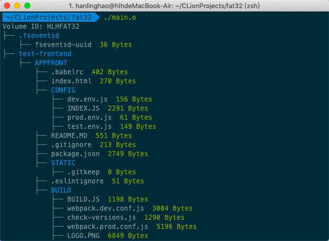

## 123
### 123
#### 123
##### 123
- aaaa
  - 123
    - 1234	
1. 123
2. 1231231
   1. 123


- [ ] 123




> 1231231
>> 1231231
>>> 1231231

`#include`
**加粗**
*斜体*


```c++
#include <stdio.h>
```

# 编译原理大作业实验报告
## 概述
## 成员及分工
### 成员
|    姓名    |  学号   |
| :--------: | :-----: |
| 丁&emsp;泉 | 1612842 |
| 高&emsp;阳 | 1612846 |
|   韩凌昊   | 1612851 |
| 何&emsp;博 | 1612852 |
|   刘元浩   | 1612872 |

### 词法分析
|      任务       |   负责人   |
| :-------------: | :--------: |
| Lex版语法分析器 | 丁泉、高阳 |
| 正则表达式转NFA |   韩凌昊   |
|     NFA合并     |   韩凌昊   |
|    NFA转DFA     |   刘元浩   |
|    DFA最小化    |    丁泉    |
| 错误和注释处理  |    何博    |
|  文件输入输出   |    何博    |

### 语法分析
|        任务        | 负责人 |
| :----------------: | :----: |
|      设计文法      | 刘元浩 |
| FIRST集、FOLLOW集  |  高阳  |
|    构造LR1项集     | 韩凌昊 |
|    合并LR1项集     |  何博  |
| 生成GOTO和ACTION表 |  何博  |
|  完成规约移入动作  |  丁泉  |
|     构造语法树     |  丁泉  |

### 语义分析与中间代码生成
|    任务    |    负责人    |
| :--------: | :----------: |
|  设计动作  | 刘元浩、何博 |
| 重构符号表 |     何博     |
|  插入动作  | 丁泉、韩凌昊 |

### 代码生成
|     任务     | 负责人 |
| :----------: | :----: |
| 生成汇编代码 | 韩凌昊 |

### 代码优化与错误处理
|       任务       |    负责人    |
| :--------------: | :----------: |
|     类型检查     | 丁泉、刘元浩 |
|    消除死代码    |  丁泉、高阳  |
| 未使用变量的优化 |     丁泉     |
|     恐慌模式     |  丁泉、高阳  |

## 文法
## 算法实现及分析
### 词法分析
#### 思路
#### 数据结构
#### 遇到的问题
#### 成果 
---
### 语法分析
#### 思路
#### 数据结构
#### 遇到的问题
#### 成果 
---
### 语义分析与中间代码生成
#### 思路
#### 数据结构
#### 遇到的问题
#### 成果 
---
### 代码生成
#### 思路
#### 数据结构
#### 遇到的问题
#### 成果 
---
### 代码优化与错误处理
#### 思路
#### 数据结构
#### 遇到的问题
#### 成果 

<table style="width:100%;">
  <tr>
    <th width="15%">op</th>
    <th width="15%">arg1</th>
    <th width="15%">arg2</th>
    <th width="15%">result</th>
    <th width="40%">说明</th>
  </tr>
  <tr>
    <th colspan="5" align="center">双目运算指令</th>
  </tr>
  <tr>
    <td>+</td>
    <td>operand1</td>
    <td>operand2</td>
    <td>result</td>
    <td>result = operand1 + operand2</td>
  </tr>
  <tr>
    <td>-</td>
    <td>operand1</td>
    <td>operand2</td>
    <td>result</td>
    <td>result = operand1 - operand2</td>
  </tr>
  <tr>
    <td>*</td>
    <td>operand1</td>
    <td>operand2</td>
    <td>result</td>
    <td>result = operand1 * operand2</td>
  </tr>
  <tr>
    <td>/</td>
    <td>operand1</td>
    <td>operand2</td>
    <td>result</td>
    <td>result = operand1 / operand2</td>
  </tr>
  <tr>
    <td>%</td>
    <td>operand1</td>
    <td>operand2</td>
    <td>result</td>
    <td>result = operand1 % operand2</td>
  </tr>
  <tr>
    <td>^</td>
    <td>operand1</td>
    <td>operand2</td>
    <td>result</td>
    <td>result = operand1 ^ operand2</td>
  </tr>
  <tr>
    <td>=</td>
    <td>operand</td>
    <td>-</td>
    <td>result</td>
    <td>result = operand</td>
  </tr>
  <tr>
    <th colspan="5" align="center">单目运算指令</th>
  </tr>
  <tr>
    <td>++</td>
    <td>operand</td>
    <td>-</td>
    <td>result</td>
    <td>result = operand++</td>
  </tr>
  <tr>
    <td>--</td>
    <td>operand</td>
    <td>-</td>
    <td>result</td>
    <td>result = operand--</td>
  </tr>
  <tr>
    <td>MINUS</td>
    <td>operand</td>
    <td>-</td>
    <td>result</td>
    <td>result = -operand</td>
  </tr>
  <tr>
    <td>!</td>
    <td>operand</td>
    <td>-</td>
    <td>result</td>
    <td>result = !operand</td>
  </tr>
  <tr>
    <th colspan="5" align="center">跳转指令（line）为跳转到的行号</th>
  </tr>
  <tr>
    <td>JMP</td>
    <td>-</td>
    <td>-</td>
    <td>line</td>
    <td>无条件跳转</td>
  </tr>
  <tr>
    <td>JE</td>
    <td>operand1</td>
    <td>operand2</td>
    <td>line</td>
    <td>operand1等于operand2则跳转</td>
  </tr>
  <tr>
    <td>JNE</td>
    <td>operand1</td>
    <td>operand2</td>
    <td>line</td>
    <td>operand1不等于operand2则跳转</td>
  </tr>
  <tr>
    <td>JG</td>
    <td>operand1</td>
    <td>operand2</td>
    <td>line</td>
    <td>operand1大于operand2则跳转</td>
  </tr>
  <tr>
    <td>JNG</td>
    <td>operand1</td>
    <td>operand2</td>
    <td>line</td>
    <td>operand1不大于operand2则跳转</td>
  </tr>
  <tr>
    <td>JGE</td>
    <td>operand1</td>
    <td>operand2</td>
    <td>line</td>
    <td>operand1大于等于operand2则跳转</td>
  </tr>
  <tr>
    <td>JNGE</td>
    <td>operand1</td>
    <td>operand2</td>
    <td>line</td>
    <td>operand1不大于等于operand2则跳转</td>
  </tr>
  <tr>
    <td>JL</td>
    <td>operand1</td>
    <td>operand2</td>
    <td>line</td>
    <td>operand1小于operand2则跳转</td>
  </tr>
  <tr>
    <td>JNL</td>
    <td>operand1</td>
    <td>operand2</td>
    <td>line</td>
    <td>operand1不小于operand2则跳转</td>
  </tr>
  <tr>
    <td>JLE</td>
    <td>operand1</td>
    <td>operand2</td>
    <td>line</td>
    <td>operand1小于等于operand2则跳转</td>
  </tr>
  <tr>
    <td>JNLE</td>
    <td>operand1</td>
    <td>operand2</td>
    <td>line</td>
    <td>operand1不小于等于operand2则跳转</td>
  </tr>
  <tr>
    <td>JZ</td>
    <td>operand</td>
    <td>-</td>
    <td>line</td>
    <td>operand为假则跳转</td>
  </tr>
  <tr>
    <td>JNZ</td>
    <td>operand</td>
    <td>-</td>
    <td>line</td>
    <td>operand为真则跳转</td>
  </tr>
  <tr>
    <th colspan="5" align="center">函数调用指令</th>
  </tr>
  <tr>
    <td>PARAM</td>
    <td>argument</td>
    <td></td>
    <td></td>
    <td>将argument添加到参数列表</td>
  </tr>
  <tr>
    <td>CALL</td>
    <td>name</td>
    <td></td>
    <td></td>
    <td>调用名为name的函数</td>
  </tr>
  <tr>
    <th colspan="5" align="center">函数定义指令</th>
  </tr>
  <tr>
    <td>FUNC</td>
    <td>name</td>
    <td></td>
    <td></td>
    <td>定义一个为name的函数</td>
  </tr>
  <tr>
    <td>ENDF</td>
    <td>name</td>
    <td></td>
    <td></td>
    <td>结束定义一个为name的函数</td>
  </tr>
  <tr>
    <td>RET</td>
    <td>argument</td>
    <td></td>
    <td></td>
    <td>终止函数，返回值为argument（可为空）</td>
  </tr>
</table>
